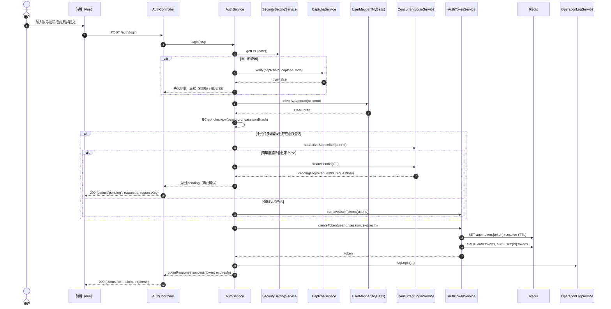
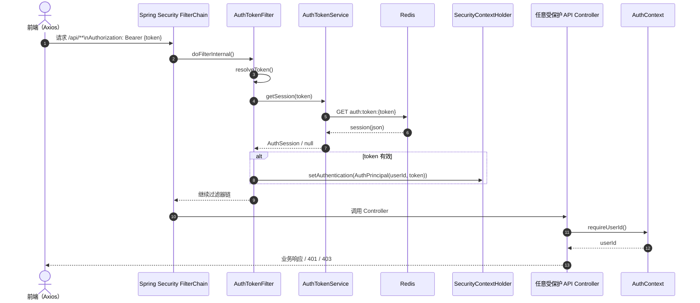
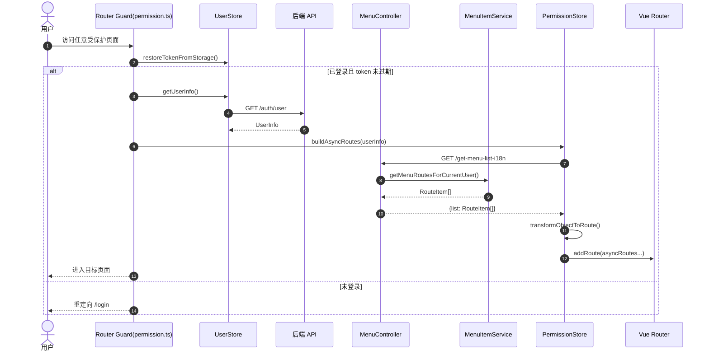
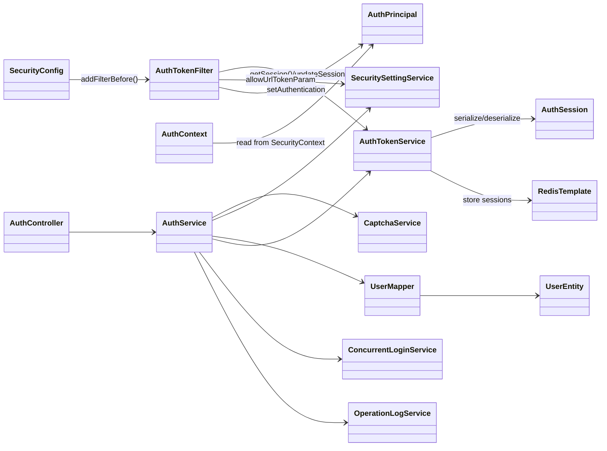
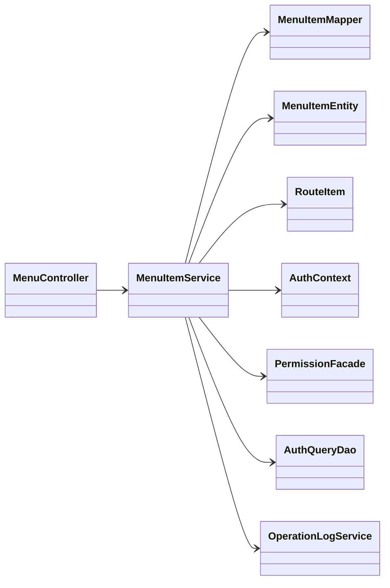

# 图表（Mermaid）

本文档使用 Mermaid 绘制类图、时序图等。若你的 Markdown 预览不支持 Mermaid，可使用支持 Mermaid 的编辑器/平台（如 VS Code Mermaid 插件、GitHub、GitLab 等）查看。

## 时序图

### 账号密码登录（含验证码、并发登录处理）

### API 请求鉴权（Bearer Token）

### 前端动态菜单/路由初始化（首次进入或刷新）

## 类图

### 认证与 Token（后端核心类关系）

### 动态菜单（后端菜单模型关系）

